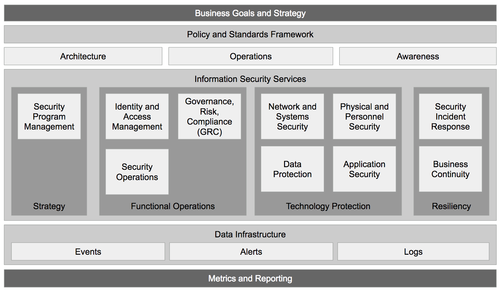

Overview
========
Each section within the Information Security Services function is compromised of numerous departments, each with their own functions to support the larger department. Not all businesses will be setup with a program like this, but many will aspire to having something similar. When speaking with someone from an organization, it's important to capture how their program is designed and attempt to map it back to a structure like this. From there, it's possible to use our product fit matrix to identify which solution would be best to offer.

Leveraging this Content
-----------------------
The best way to use this material is to treat it as a loosely defined mapping of an organization. Each product or service your organization offers should in some way help one of these departments/sub-departments/roles in some form. Using a spreadsheet, list out each department and sub-department, then a listing of columns, one for each product or service your organization offers. Using a simple 0-3 (low fit to high fit), mark each row with a number that best describes your product fit to solving that sub-department's needs. Afterwards, add the columns and identify the key departments your product fits in best. Mapping your products to this structure can give you a rough idea of where to target marketing efforts or further enablement material creation.

Program Details
===============
* `Application Security`_
* `Business Continuity`_
* `Data Protection`_
* `Governance, Risk & Compliance`_
* `Identity and Access Management`_
* `Network and Systems Security`_
* `Physical and Personnel Security`_
* `Security Incident Response`_
* `Security Operations`_
* `Security Program Management`_

.. _`Application Security`: application-security.rst
.. _`Business Continuity`: business-continuity.rst
.. _`Data Protection`: data-protection.rst
.. _`Governance, Risk & Compliance`: governance-risk-compliance.rst
.. _`Identity and Access Management`: identity-and-access-management.rst
.. _`Network and Systems Security`: network-and-systems-security.rst
.. _`Physical and Personnel Security`: physical-and-personnel-security.rst
.. _`Security Incident Response`: security-incident-response.rst
.. _`Security Operations`: security-operations.rst
.. _`Security Program Management`: security-program-manegement.rst

